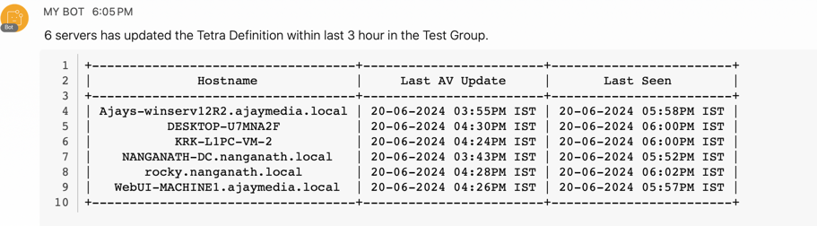

# find_AV_LastUpdated_EP_groups

### Introduction
This article shows how easy it is to leverage API of any product and create a continuous monitoring script for any change in the output.

### Problem
Currently, for fetching the AV last updated endpoint's list customer had to follow below steps:
1. Manually filter the Computer's list on AMP Console for a specific group
2. Export the output in CSV format
3. Filter out the endpoints based on the last-seen column in the CSV
4. Find the endpoints with last-seen info for more than 1-2hours ago

This manual effort needs to be eliminated.

### Solution
Using the /v1/computers AMP API, this script is created to continuously monitor and find the hostname by AV Definitions last updated and Last Seen by requested hours within a specific group.

In addition, the output is pushed in a Teams Space for anyone's consumption.
You can run this script using crontab as per requirement on a server for continuous monitoring.

Following is the expected post in the WebEx Teams room:
